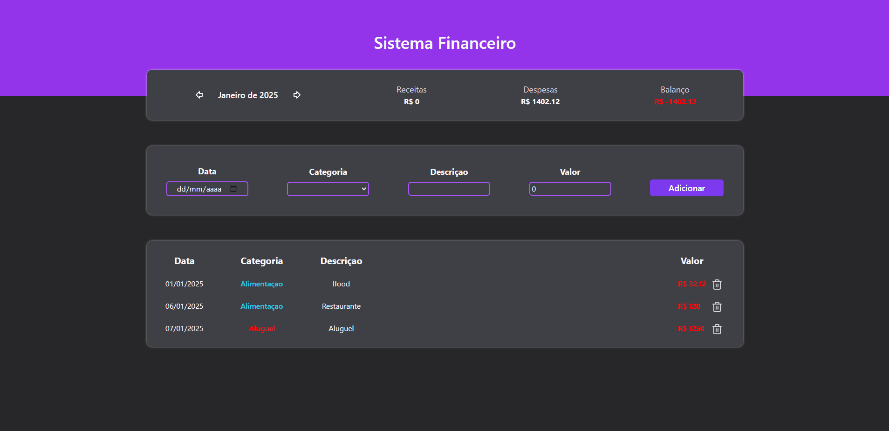

<h1 align="center">Financial Management 📊</h1>

<h2>📜 Project Description</h2>

  Welcome to my Financial Management System!

The main goal of this project is to assist in managing personal finances in a simple and practical way. I developed this application using React, TypeScript, and TailwindCSS, technologies that provide a dynamic and responsive interface, along with well-structured code.

### 🚀 Tecnologias Utilizadas:

    
    
    

<h2>📆 Key Features</h2>

📊 Income and Expense Management:  
The application allows you to add financial entries such as income and expenses, categorizing them to simplify tracking.

📅 Monthly Filtering:  
Data can be filtered by month, helping you analyze expenses and earnings for specific periods.

⚙️ Responsiveness and Style:  
Using TailwindCSS, I created a modern, responsive, and visually appealing design, ensuring a great experience on any device.

  This project showcases my skills as a developer, including programming logic, state management, and integrating modern styles with TailwindCSS. I will continue adding new features to expand the system's functionality and make it even more efficient. 🚀

### 📸 Preview

